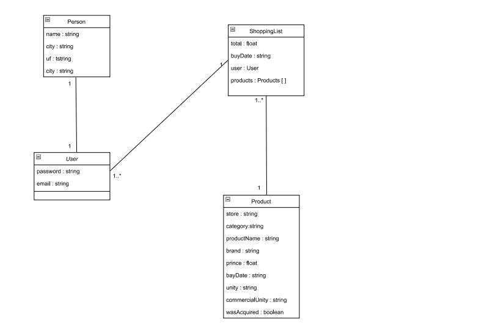

# Descrição

Projeto pessoal de criação de uma lista de compras que irá auxiliar na minhas compra mensais e gerar alguns relatório, esse repositório é responsavel pela API backend da aplicação que utiliza NestJS, a API encontra-se hospedada no heroku.

# Artefatos
  ## Diagrama de classe <br>
 
 
 <br>
# Documentação da Api (Heroku) <br>
https://lista-backend.herokuapp.com/api#


## Usuário para teste <br>
* Faça login na rota https://lista-backend.herokuapp.com/api#/Auth/AuthController_login utilizando o objeto abaixo:<br>
```
{
    "email": "tadeu_junior@outlook.com",
    "password": "Tadeu@123."
}

```
* Insira o token em authorize sem as "aspas";
* Se prefirir crie um novo usuário.<br>

### A base possui uma lista com mais 60 produtos cadastrados na lista de id 1.

## Json com a lista de produtos <br>

Se for necessário deixei disponivél a lista de uma compra que fiz, você pode criar uma lista nova e registrar esses produtos se quise no seguinte link: https://github.com/Tadeujr/lista-backend/blob/master/listaTeste.json

<b>OBS:</b> Lembre-se de altera o campo list com o id para sua nova lista criada

# Rodando a aplicação localmente
## Instalação das bibliotecas  

* instale o Node: https://nodejs.org/en/ ;
* Após baixar o repositório execute no terminal o seguinte comando:

```bash
$ npm install

```

# Rodando a aplicação
Configure o arquivo env. como no exemplo contido no repositório <a href="https://github.com/Tadeujr/lista-backend/blob/development/.env.example">Link</a> e escolha alguns dos camandos para executar.
```bash
# development
$ npm run start:dev


# production mode
$ npm run start:prod
```

# Testes (em andamento)
 Apenas o a criação de novo usuário do entidade User foi testado
```bash
# unit tests
$ npm run test

# cucumber
npm run test:bdd

```


# Populando a base
## Com o Json
Após criar o usuário:
 Crie uma nova lista na rota shoppingList;<br>
 Na rota de produto faça um post com os dados do arquivo https://github.com/Tadeujr/lista-backend/blob/development/listaTeste.json ;<br>
 Não esqueça de alterar o id da lista no json, com o id da lista criado na rota shoppingList.
 
## Com o sql
  Vá na database e execute o seed.sql em https://github.com/Tadeujr/lista-backend/blob/master/seed.sql ;<br>
  Não esqueça de alterar o id da lista no sql, com o id da lista criado na rota shoppingList.
